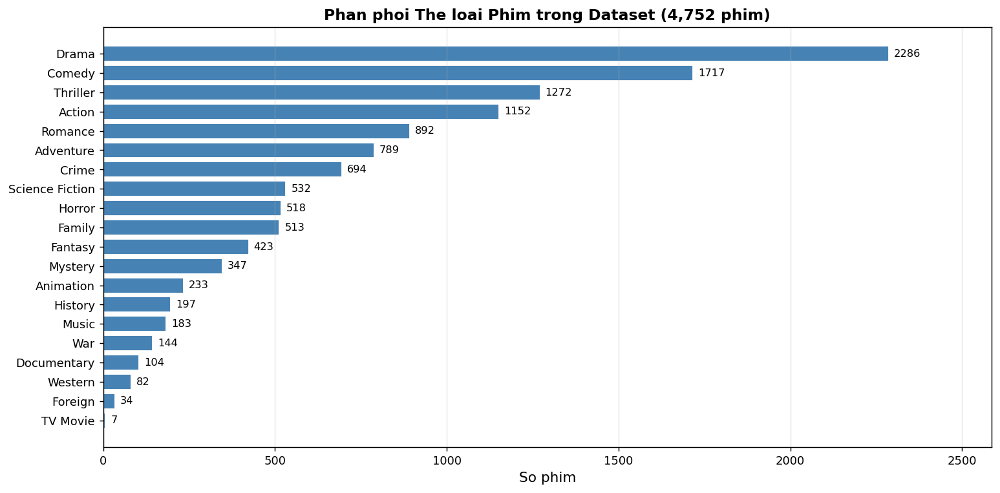
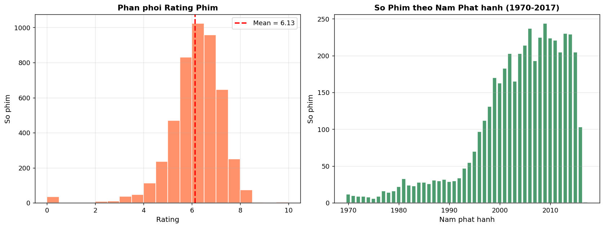
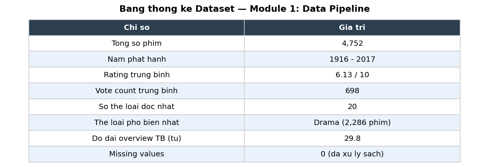

# Chương 3: Mô Tả Tập Dữ Liệu

## 3.1 Nguồn Gốc Dữ Liệu

### 3.1.1 TMDB 5000 Movies Dataset

Dự án sử dụng tập dữ liệu **TMDB 5000 Movies** — một tập dữ liệu công khai được lấy từ The Movie Database (TMDB) API và phân phối qua nền tảng Kaggle. Tập dữ liệu này bao gồm hai file CSV:

| File | Mô tả | Số dòng | Kích thước |
|------|--------|---------|-----------|
| `tmdb_5000_movies.csv` | Thông tin phim | 4,803 | ~5 MB |
| `tmdb_5000_credits.csv` | Thông tin diễn viên và đạo diễn | 4,803 | ~40 MB |

**Giấy phép:** Dữ liệu được TMDB cung cấp theo điều khoản Attribution-NonCommercial (phi thương mại, phải ghi nguồn).

### 3.1.2 TMDB API v3

Ngoài hai file CSV, hệ thống còn gọi **TMDB API v3** để lấy URL ảnh poster cho từng phim. Mỗi phim có một trường `poster_path` trong CSV, nhưng URL đầy đủ cần được xây dựng theo định dạng:

```
https://image.tmdb.org/t/p/w500{poster_path}
```

Quá trình fetch poster sử dụng 20 luồng song song (ThreadPoolExecutor) và cache kết quả vào `poster_paths_cache.json` để tránh gọi API lặp lại.

---

## 3.2 Cấu Trúc Dữ Liệu Gốc

### 3.2.1 File tmdb_5000_movies.csv

| Cột | Kiểu dữ liệu | Mô tả |
|-----|-------------|-------|
| `budget` | int | Ngân sách sản xuất (USD) |
| `genres` | JSON string | Danh sách thể loại `[{"id": ..., "name": ...}]` |
| `homepage` | string | URL trang web phim |
| `id` | int | ID phim trên TMDB |
| `keywords` | JSON string | Danh sách từ khóa |
| `original_language` | string | Ngôn ngữ gốc (ví dụ: "en") |
| `original_title` | string | Tên gốc |
| `overview` | string | Tóm tắt nội dung |
| `popularity` | float | Điểm phổ biến |
| `production_companies` | JSON string | Công ty sản xuất |
| `production_countries` | JSON string | Quốc gia sản xuất |
| `release_date` | date | Ngày phát hành |
| `revenue` | int | Doanh thu (USD) |
| `runtime` | float | Thời lượng (phút) |
| `spoken_languages` | JSON string | Ngôn ngữ trong phim |
| `status` | string | Trạng thái (Released, Post Production...) |
| `tagline` | string | Tagline phim |
| `title` | string | Tên phim |
| `vote_average` | float | Điểm đánh giá trung bình (0–10) |
| `vote_count` | int | Số lượt bình chọn |

### 3.2.2 File tmdb_5000_credits.csv

| Cột | Kiểu dữ liệu | Mô tả |
|-----|-------------|-------|
| `movie_id` | int | ID phim (khớp với cột `id` của movies.csv) |
| `title` | string | Tên phim |
| `cast` | JSON string | Danh sách diễn viên (name, character, order) |
| `crew` | JSON string | Danh sách thành viên đoàn phim (director, producer...) |

---

## 3.3 Thống Kê Mô Tả

Sau khi merge hai file và lọc theo điều kiện hợp lệ, tập dữ liệu cuối cùng gồm **4,768 phim** với các đặc điểm sau:

### 3.3.1 Thống Kê Tổng Quát

| Thuộc tính | Giá trị |
|-----------|---------|
| Tổng số phim ban đầu | 4,803 |
| Phim sau lọc (có overview + genres) | 4,771 |
| Phim có poster hợp lệ | 4,752 |
| Phim có đặc trưng CNN + TF-IDF | 4,768 |
| Số thể loại duy nhất | 20 (TMDB) / 17 (dùng trong NB) |
| Khoảng thời gian | 1916 – 2017 |
| Điểm rating trung bình | 6.13 / 10 |
| Số lượt bình chọn trung bình | 698 |
| Độ dài overview trung bình | 29.8 từ |
| Độ dài overview min–max | 2 – 108 từ |

### 3.3.2 Phân Phối Thể Loại

Bảng dưới đây liệt kê 20 thể loại và số lượng phim thuộc mỗi thể loại (một phim có thể thuộc nhiều thể loại):

| Thể loại | Số phim | Tỷ lệ (%) |
|---------|---------|-----------|
| Drama | 2,292 | 48.1% |
| Comedy | 1,722 | 36.1% |
| Thriller | 1,278 | 26.8% |
| Action | 1,153 | 24.2% |
| Romance | 878 | 18.4% |
| Adventure | 706 | 14.8% |
| Crime | 660 | 13.8% |
| Science Fiction | 518 | 10.9% |
| Horror | 487 | 10.2% |
| Family | 394 | 8.3% |
| Fantasy | 372 | 7.8% |
| Mystery | 293 | 6.1% |
| Animation | 248 | 5.2% |
| History | 233 | 4.9% |
| Music | 187 | 3.9% |
| War | 165 | 3.5% |
| Documentary | 138 | 2.9% |
| Western | 88 | 1.8% |
| Foreign | 67 | 1.4% |
| TV Movie | 23 | 0.5% |



*Hình 3.1: Biểu đồ cột thể hiện số lượng phim theo từng thể loại. Drama chiếm ưu thế với 2,292 phim (48.1%), tiếp theo là Comedy và Thriller.*

### 3.3.3 Phân Phối Rating và Năm Phát Hành

**Rating (vote_average):**

| Khoảng rating | Số phim | Tỷ lệ |
|--------------|---------|-------|
| 0.0 – 4.0 | 187 | 3.9% |
| 4.0 – 5.0 | 424 | 8.9% |
| 5.0 – 6.0 | 900 | 18.9% |
| 6.0 – 7.0 | 1,643 | 34.5% |
| 7.0 – 8.0 | 1,219 | 25.6% |
| 8.0 – 10.0 | 395 | 8.3% |

Phân phối rating xấp xỉ chuẩn lệch phải (right-skewed) với điểm trung bình 6.13 và độ lệch chuẩn ~1.0. Điều này phản ánh rằng phần lớn phim trong TMDB đạt chất lượng trung bình khá, ít phim rất tệ hoặc rất xuất sắc.

**Năm phát hành:**

| Thập kỷ | Số phim |
|---------|---------|
| Trước 1980 | 312 |
| 1980 – 1989 | 391 |
| 1990 – 1999 | 654 |
| 2000 – 2009 | 1,287 |
| 2010 – 2017 | 2,124 |

Tập dữ liệu có xu hướng thiên về phim hiện đại, với 44.5% phim được sản xuất từ năm 2010 đến 2017.



*Hình 3.2: (Trái) Histogram phân phối điểm rating vote_average. (Phải) Biểu đồ cột số lượng phim theo thập kỷ.*

### 3.3.4 Đặc Điểm Văn Bản Overview

Phần tóm tắt nội dung (overview) là nguồn thông tin văn bản chính cho TF-IDF:

| Thống kê | Giá trị |
|---------|---------|
| Số từ trung bình | 29.8 |
| Số từ tối thiểu | 2 |
| Số từ tối đa | 108 |
| Median | 28 từ |
| Số phim có overview ngắn (< 10 từ) | 89 |

Độ dài overview khá ngắn, trung bình chỉ ~30 từ. Điều này đặt ra thách thức cho mô hình ngôn ngữ: tín hiệu ngữ nghĩa hạn chế hơn so với các tập dữ liệu có mô tả dài hơn (như book descriptions hoặc product reviews).

---

## 3.4 Cấu Trúc Dữ Liệu Sau Tiền Xử Lý

Sau toàn bộ quá trình xử lý (chi tiết tại Chương 4), mỗi phim được lưu với schema sau trong `data/processed/movies_valid.csv`:

| Cột | Kiểu | Mô tả |
|-----|------|-------|
| `movie_id` | int | ID phim TMDB |
| `title` | string | Tên phim |
| `year` | int | Năm phát hành |
| `genres` | JSON string | Danh sách thể loại |
| `overview_clean` | string | Mô tả đã làm sạch |
| `poster_url` | string | URL ảnh poster |
| `rating` | float | Điểm TMDB |
| `vote_count` | int | Số lượt bình chọn |
| `cluster_id` | int | Nhãn cụm K-Means (0–19) |
| `pca_x` | float | Tọa độ PCA chiều thứ nhất |
| `pca_y` | float | Tọa độ PCA chiều thứ hai |

---

## 3.5 Nhận Xét về Chất Lượng Dữ Liệu

**Điểm mạnh:**
- Tập dữ liệu đa dạng về thể loại, thời gian, và ngôn ngữ.
- Thông tin phim tương đối đầy đủ (title, overview, genres là bắt buộc).
- Poster có sẵn thông qua TMDB API với chất lượng ổn định.

**Điểm yếu:**
- **Phân phối thể loại không đồng đều:** Drama chiếm ~48% trong khi TV Movie chỉ ~0.5%, tạo ra hiện tượng class imbalance nghiêm trọng trong bài toán phân loại.
- **Overview ngắn:** Trung bình 29.8 từ giới hạn khả năng học ngữ nghĩa của TF-IDF.
- **Dữ liệu lịch sử:** Tập dữ liệu chỉ đến năm 2017, không phản ánh xu hướng điện ảnh gần đây.
- **Thiên lệch theo ngôn ngữ:** Phần lớn phim là tiếng Anh hoặc có mô tả tiếng Anh.
- **Không có dữ liệu người dùng:** Không thể áp dụng Collaborative Filtering hoặc Matrix Factorization.

Những điểm yếu này ảnh hưởng trực tiếp đến hiệu suất các mô hình và được thảo luận chi tiết tại Chương 13.



*Hình 3.3: Bảng tóm tắt các chỉ số thống kê chính của tập dữ liệu TMDB 5000 sau tiền xử lý.*
