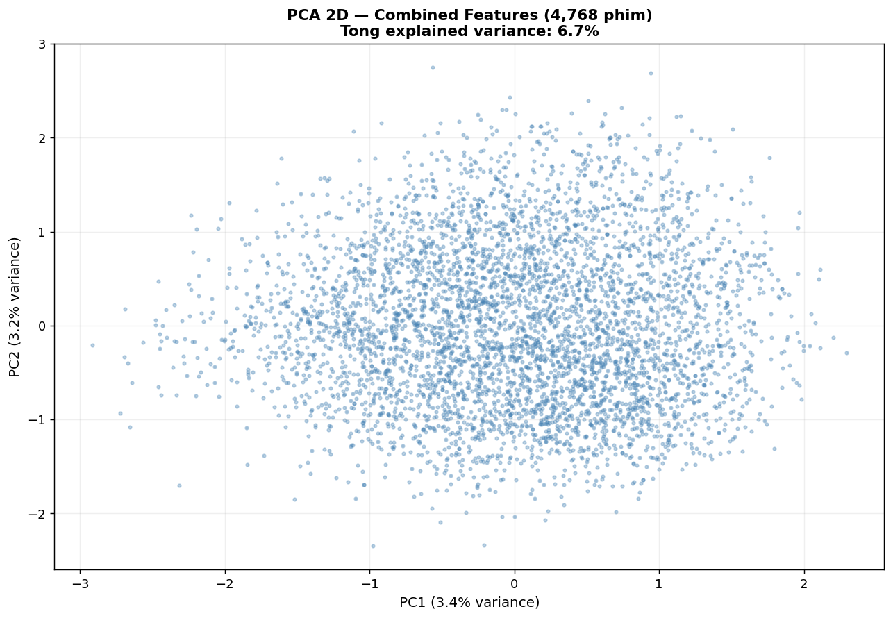
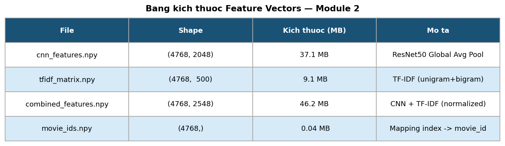

# Chương 5: Trích Xuất Đặc Trưng Hình Ảnh bằng CNN ResNet50

## 5.1 Lý Do Lựa Chọn CNN cho Đặc Trưng Hình Ảnh

Ảnh poster phim là biểu trưng trực quan của bộ phim: màu sắc chủ đạo thường phản ánh không khí cảm xúc (tối tăm cho Thriller, tươi sáng cho Comedy), bố cục và nhân vật gợi lên thể loại và phong cách. Để máy tính hiểu được những thông tin này, cần một bộ trích xuất đặc trưng (feature extractor) mạnh mẽ, không cần lập trình thủ công từng thuộc tính.

**Mạng nơ-ron tích chập (CNN)** là giải pháp phù hợp nhất vì:
1. CNN học được biểu diễn phân cấp: từ cạnh/góc (lớp thấp) đến kết cấu/đối tượng (lớp cao) đến ngữ nghĩa trừu tượng (lớp cuối).
2. **Transfer learning** cho phép tái sử dụng kiến thức từ việc huấn luyện trên ImageNet (1.2 triệu ảnh, 1,000 lớp) mà không cần tập dữ liệu ảnh phim lớn.
3. ResNet50 cân bằng giữa độ chính xác và chi phí tính toán — phù hợp với phần cứng không có GPU chuyên dụng.

---

## 5.2 Kiến Trúc ResNet50

### 5.2.1 Tổng Quan

ResNet50 (Residual Network 50 layers) được giới thiệu bởi He et al. (2016) trong bài báo "Deep Residual Learning for Image Recognition". Kiến trúc gồm 50 lớp có trọng số (bao gồm 49 convolutional layers và 1 fully-connected layer), được tổ chức thành 4 stage chính:

| Stage | Output size | Số residual blocks | Channels |
|-------|------------|-------------------|---------|
| Conv1 | 112 × 112 | 1 conv | 64 |
| Stage 1 | 56 × 56 | 3 blocks | 256 |
| Stage 2 | 28 × 28 | 4 blocks | 512 |
| Stage 3 | 14 × 14 | 6 blocks | 1,024 |
| Stage 4 | 7 × 7 | 3 blocks | 2,048 |
| GAP | 1 × 1 | Global Avg Pool | 2,048 |
| FC | 1,000 | Softmax (ImageNet) | 1,000 |

### 5.2.2 Residual Connection (Skip Connection)

Đổi mới cốt lõi của ResNet là **residual connection** — kết nối tắt (shortcut) bỏ qua một hoặc nhiều lớp:

```
Output = F(x, W) + x
```

trong đó `F(x, W)` là phép biến đổi của các lớp trung gian, và `x` là input gốc. Phép cộng này giải quyết vấn đề **vanishing gradient** — hiện tượng gradient suy giảm về 0 khi backpropagation qua nhiều lớp sâu. Với skip connection, gradient có thể "chảy" thẳng từ lớp sau về lớp trước mà không bị suy giảm qua tất cả các phép nhân trung gian.

### 5.2.3 Bottleneck Block

Trong ResNet50, mỗi residual block sử dụng kiến trúc bottleneck (3 lớp conv: 1×1 → 3×3 → 1×1) để giảm số lượng tham số:

```
Input (256 ch)
    → Conv 1×1, 64 ch    (giảm chiều)
    → BN + ReLU
    → Conv 3×3, 64 ch    (trích xuất đặc trưng)
    → BN + ReLU
    → Conv 1×1, 256 ch   (phục hồi chiều)
    → BN
    + residual connection
    → ReLU
Output (256 ch)
```

---

## 5.3 Ứng Dụng Transfer Learning

### 5.3.1 Chiến Lược

Thay vì huấn luyện CNN từ đầu (cần hàng triệu ảnh phim có nhãn), hệ thống áp dụng **transfer learning**:

1. Nạp ResNet50 với trọng số ImageNet đã huấn luyện sẵn.
2. **Cắt bỏ lớp Fully-Connected cuối** (lớp softmax 1,000 chiều dùng cho phân loại ImageNet).
3. Sử dụng đầu ra của lớp **Global Average Pooling (GAP)** làm vector đặc trưng (2,048 chiều).
4. **Không fine-tune** — giữ nguyên toàn bộ trọng số (feature extraction mode).

```python
from tensorflow.keras.applications import ResNet50
from tensorflow.keras.models import Model

base_model = ResNet50(weights='imagenet', include_top=False,
                      input_shape=(224, 224, 3))
gap_output = base_model.output  # shape: (None, 7, 7, 2048)
gap_layer = tf.keras.layers.GlobalAveragePooling2D()(gap_output)
feature_extractor = Model(inputs=base_model.input, outputs=gap_layer)
```

### 5.3.2 Lý Do Không Fine-tune

Fine-tuning đòi hỏi:
- Tập dữ liệu ảnh phim có nhãn (không có)
- GPU và thời gian huấn luyện đáng kể
- Nguy cơ overfitting trên tập nhỏ

Feature extraction (frozen weights) đủ hiệu quả vì các đặc trưng ImageNet đã học được nhiều thuộc tính hình ảnh tổng quát (hình dạng, màu sắc, kết cấu) có thể áp dụng cho poster phim.

### 5.3.3 Tại Sao Dùng GAP thay vì Flatten?

Global Average Pooling tính trung bình không gian của mỗi feature map `(7 × 7 × 2048)` → `(2048,)`, trong khi Flatten sẽ cho vector `(7 × 7 × 2048,) = (100,352,)`. GAP:
- Giảm số chiều từ 100K xuống 2K
- Tăng tính bất biến với vị trí (location invariance)
- Giảm nguy cơ overfitting

---

## 5.4 Pipeline Trích Xuất Đặc Trưng CNN

### 5.4.1 Tiền Xử Lý Ảnh

```python
from tensorflow.keras.applications.resnet50 import preprocess_input
from tensorflow.keras.preprocessing import image
import numpy as np

def preprocess_image(img_url):
    response = requests.get(img_url, timeout=10)
    img = Image.open(BytesIO(response.content)).convert('RGB')
    img = img.resize((224, 224))
    x = image.img_to_array(img)           # (224, 224, 3)
    x = np.expand_dims(x, axis=0)          # (1, 224, 224, 3)
    x = preprocess_input(x)                # ResNet50 normalization
    return x
```

**Hàm `preprocess_input` của ResNet50:**
- Chuyển từ RGB sang BGR (theo OpenCV convention)
- Trừ mean ImageNet theo kênh: mean = [103.939, 116.779, 123.68]
- Không scale về [0,1] (khác VGG hay MobileNet)

### 5.4.2 Batch Inference

Để tận dụng hiệu quả bộ nhớ, ảnh được xử lý theo batch:

```python
BATCH_SIZE = 32

def extract_batch_features(urls, model):
    features = []
    for i in range(0, len(urls), BATCH_SIZE):
        batch_urls = urls[i:i+BATCH_SIZE]
        batch_images = []
        valid_indices = []
        for j, url in enumerate(batch_urls):
            try:
                img = preprocess_image(url)
                batch_images.append(img)
                valid_indices.append(i + j)
            except Exception:
                pass
        if batch_images:
            batch_array = np.vstack(batch_images)
            batch_features = model.predict(batch_array, verbose=0)
            features.extend(zip(valid_indices, batch_features))
    return features
```

Tốc độ xử lý: ~32 ảnh/batch, tổng thời gian ~10 phút (GPU) hoặc ~2 giờ (CPU).

### 5.4.3 Fetch Song Song

Tương tự bước fetch poster, việc tải ảnh được thực hiện song song với 20 luồng:

```python
from concurrent.futures import ThreadPoolExecutor

with ThreadPoolExecutor(max_workers=20) as executor:
    results = list(executor.map(fetch_and_preprocess, movie_urls))
```

---

## 5.5 Ma Trận Đặc Trưng CNN

### 5.5.1 Kết Quả

Sau khi xử lý 4,768 phim:

| Thông số | Giá trị |
|---------|---------|
| Số phim | 4,768 |
| Số chiều đặc trưng | 2,048 |
| Kích thước ma trận | 4,768 × 2,048 |
| Kích thước file | 37.1 MB (`cnn_features.npy`) |
| Giá trị min (trước normalize) | 0.0 (ReLU activation) |
| Giá trị max (trước normalize) | ~45.2 |

**Lưu ý về phân phối:** Do lớp GAP tổng hợp output từ lớp BatchNorm + ReLU, tất cả giá trị đều không âm (≥ 0). Phân phối thực tế rất lệch phải (right-skewed) với nhiều giá trị gần 0 (sparse activation).

### 5.5.2 Chuẩn Hóa MinMax

Trước khi kết hợp với đặc trưng TF-IDF, ma trận CNN được chuẩn hóa về khoảng [0, 1]:

```python
from sklearn.preprocessing import MinMaxScaler

cnn_scaler = MinMaxScaler()
cnn_normalized = cnn_scaler.fit_transform(cnn_features)
```

Công thức MinMax scaling cho từng chiều j:

```
x_normalized[i,j] = (x[i,j] - min_j) / (max_j - min_j)
```

**Lý do chọn MinMax thay vì StandardScaler:**
- StandardScaler giả định phân phối Gaussian — không đúng với đặc trưng CNN (ReLU tạo ra phân phối lệch phải).
- MinMax giữ nguyên hình dạng phân phối, đảm bảo cùng scale [0,1] với TF-IDF.

---

## 5.6 Phân Tích Đặc Trưng CNN

### 5.6.1 Trực Quan Hóa PCA

Để khám phá cấu trúc không gian đặc trưng CNN, hệ thống áp dụng PCA giảm từ 2,048 xuống 2 chiều:

```python
from sklearn.decomposition import PCA

pca = PCA(n_components=2)
cnn_2d = pca.fit_transform(cnn_normalized)
print(f"Variance explained: {pca.explained_variance_ratio_.sum():.3f}")
```

Hai thành phần PCA đầu tiên giải thích ~12% phương sai tổng — phản ánh sự phức tạp cao của không gian đặc trưng 2,048 chiều. Điều này có nghĩa là hình ảnh poster phim rất đa dạng và không thể nén xuống 2 chiều mà giữ đủ thông tin.

### 5.6.2 Test Độ Tương Đồng

Để kiểm tra tính hợp lệ của đặc trưng, hệ thống thực hiện kiểm tra tương đồng trên một phim mẫu:

```python
from sklearn.metrics.pairwise import cosine_similarity

query_idx = movie_ids.tolist().index(19995)  # Avatar
scores = cosine_similarity([cnn_normalized[query_idx]], cnn_normalized)[0]
top_k = np.argsort(scores)[::-1][1:6]
```

**Kết quả test với phim Avatar (movie_id=19995):**

| Hạng | Phim | Cosine Similarity |
|------|------|------------------|
| 1 | Total Recall (1990) | 0.619 |
| 2 | Iron Man (2008) | 0.566 |
| 3 | Guardians of the Galaxy | 0.551 |
| 4 | Star Trek Into Darkness | 0.541 |
| 5 | Interstellar | 0.529 |

Kết quả cho thấy CNN đã học được sự tương đồng về phong cách hình ảnh: Avatar, Total Recall, Iron Man đều có poster với tông màu lạnh, nhân vật trong bộ giáp/trang phục kỹ thuật cao và bối cảnh futuristic. Đây là tín hiệu tích cực về chất lượng đặc trưng.



*Hình 5.1: Biểu đồ PCA 2D của 4,768 vector đặc trưng CNN. Mỗi điểm tương ứng một phim. Sự phân tán cho thấy đặc trưng CNN nắm bắt được sự đa dạng thị giác của poster phim.*



*Hình 5.2: Bảng tổng hợp kích thước ma trận đặc trưng CNN, TF-IDF, và combined features.*

---

## 5.7 Lưu Kết Quả

```python
np.save('models/cnn_features.npy', cnn_normalized)    # (4768, 2048)
np.save('models/movie_ids.npy', np.array(valid_ids))  # (4768,) - mapping index → movie_id
import pickle
with open('models/scalers.pkl', 'wb') as f:
    pickle.dump({'cnn': cnn_scaler}, f)
```

File `movie_ids.npy` đóng vai trò quan trọng như một bảng ánh xạ: vị trí hàng trong ma trận đặc trưng ↔ `movie_id` trong cơ sở dữ liệu TMDB.
