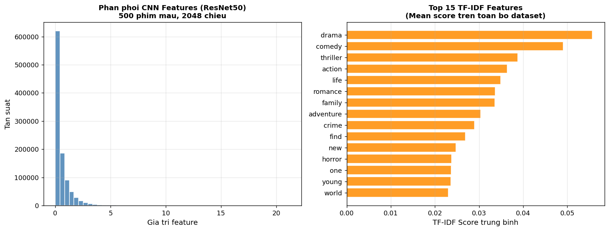

# Chương 6: Trích Xuất Đặc Trưng Văn Bản bằng TF-IDF

## 6.1 Giới Thiệu và Động Lực

Ảnh poster cung cấp thông tin thị giác, nhưng không truyền đạt được nội dung cốt truyện, chủ đề tư tưởng, hay cảm xúc kịch tính của một bộ phim. Phần mô tả văn bản (overview) chứa đựng ngữ nghĩa phong phú này. Câu hỏi đặt ra là: làm thế nào để biến một đoạn văn bản ngắn thành vector số học để máy tính tính toán độ tương đồng?

**TF-IDF (Term Frequency–Inverse Document Frequency)** là phương pháp biểu diễn văn bản kinh điển, có nền tảng lý thuyết vững chắc và hiệu suất thực tế được kiểm chứng trong hàng thập kỷ. Đây là lựa chọn phù hợp cho hệ thống KhaiPha vì:

1. **Không cần dữ liệu huấn luyện lớn:** TF-IDF là phương pháp không tham số (unsupervised), chỉ cần corpus văn bản.
2. **Tính diễn giải cao:** Mỗi chiều tương ứng một từ hoặc cụm từ cụ thể — dễ debug và giải thích.
3. **Hiệu quả tính toán:** Biểu diễn thưa (sparse), tính toán nhanh với scikit-learn.
4. **Phù hợp với văn bản ngắn:** TF-IDF hoạt động tốt với mô tả dưới 100 từ (trường hợp của TMDB overview).

---

## 6.2 Nền Tảng Toán Học

### 6.2.1 Term Frequency (TF)

TF đo tần suất xuất hiện của từ `t` trong tài liệu `d`. Hệ thống sử dụng **sublinear TF scaling** (log normalization):

```
TF_sublinear(t, d) = 1 + log(count(t, d))    nếu count(t, d) > 0
                   = 0                         nếu count(t, d) = 0
```

**Lý do dùng sublinear scaling:**
TF tuyến tính thô (`count(t, d)`) sẽ cho điểm quá cao cho từ xuất hiện nhiều lần trong một tài liệu (ví dụ: từ "action" xuất hiện 10 lần không có ý nghĩa gấp 10 lần so với xuất hiện 1 lần). Log scaling giảm bớt ảnh hưởng này, làm mượt phân phối tần suất.

### 6.2.2 Inverse Document Frequency (IDF)

IDF đo tính hiếm của từ `t` trên toàn corpus:

```
IDF(t) = log((1 + N) / (1 + df(t))) + 1
```

trong đó:
- `N` = 4,768 (tổng số tài liệu)
- `df(t)` = số tài liệu chứa từ `t`
- `+1` trong mẫu số: xử lý trường hợp `df(t) = 0` (smooth IDF)
- `+1` ngoài cùng: đảm bảo IDF không âm

**Ý nghĩa:** Từ xuất hiện trong nhiều phim (ví dụ: "film", "story") có IDF thấp → ít quan trọng. Từ xuất hiện trong ít phim (ví dụ: "dystopian", "yakuza") có IDF cao → đặc trưng riêng biệt hơn.

### 6.2.3 TF-IDF Score

```
TFIDF(t, d) = TF_sublinear(t, d) × IDF(t)
```

### 6.2.4 L2 Normalization

Sau khi tính TF-IDF, mỗi vector tài liệu được chuẩn hóa L2:

```
v_normalized = v / ||v||_2
```

Điều này đảm bảo rằng độ tương đồng cosine giữa hai tài liệu không bị ảnh hưởng bởi độ dài văn bản (phim có overview dài không có lợi thế hơn phim có overview ngắn).

---

## 6.3 Cấu Hình TF-IDF Vectorizer

```python
from sklearn.feature_extraction.text import TfidfVectorizer

tfidf = TfidfVectorizer(
    max_features=500,      # Giữ 500 từ có TF-IDF cao nhất
    ngram_range=(1, 2),    # Unigrams và bigrams
    min_df=2,              # Loại từ xuất hiện trong < 2 tài liệu
    sublinear_tf=True,     # Log scaling cho TF
    norm='l2'              # Chuẩn hóa L2
)

tfidf_matrix = tfidf.fit_transform(df['text_combined'])
```

### 6.3.1 Giải Thích Từng Tham Số

**`max_features=500`:**
Giữ lại 500 từ/cụm từ có TF-IDF trung bình cao nhất trên toàn corpus. Con số 500 được chọn để:
- Đủ lớn để nắm bắt đa dạng chủ đề (500 > số thể loại)
- Đủ nhỏ để vector không quá thưa, giảm chiều so với CNN (2,048)
- Tránh noise từ các từ hiếm nhưng không có nghĩa

**`ngram_range=(1, 2)`:**
Bao gồm cả unigrams (từ đơn) và bigrams (cụm 2 từ). Bigrams nắm bắt được các cụm có nghĩa mà unigrams bỏ qua:
- "science fiction" (bigram) mang nghĩa khác "science" + "fiction" (unigrams riêng lẻ)
- "love story", "action adventure", "outer space" là các bigrams đặc trưng

**`min_df=2`:**
Loại bỏ từ xuất hiện trong ít hơn 2 tài liệu. Những từ cực kỳ hiếm (chỉ 1 phim) thường là lỗi chính tả, tên riêng đặc biệt, hoặc không đủ tín hiệu để học tương đồng.

**`sublinear_tf=True`:**
Áp dụng log scaling như đã giải thích ở Mục 6.2.1.

---

## 6.4 Input: Trường Text Kết Hợp

TF-IDF được áp dụng trên trường `text_combined` — sự kết hợp giữa mô tả đã làm sạch và thể loại:

```python
df['text_combined'] = df['overview_clean'] + ' ' + \
                      df['genres_list'].apply(lambda x: ' '.join(x).lower())
```

**Ví dụ:**

| Phim | overview_clean | genres | text_combined |
|------|---------------|--------|--------------|
| Avatar | "paraplegic marine dispatched moon pandora..." | Action, Adventure, Science Fiction | "paraplegic marine dispatched moon pandora... action adventure science fiction" |
| The Dark Knight | "batman raise stake war crime help lieutenant..." | Action, Crime, Drama | "batman raise stake war crime help lieutenant... action crime drama" |

Việc bổ sung thể loại vào văn bản giúp TF-IDF phân biệt hai phim có cùng nội dung nhưng khác thể loại.

---

## 6.5 Ma Trận TF-IDF

### 6.5.1 Kết Quả

| Thông số | Giá trị |
|---------|---------|
| Số phim | 4,768 |
| Số chiều (từ vựng) | 500 |
| Kích thước ma trận | 4,768 × 500 |
| Kích thước file | 9.1 MB (`tfidf_matrix.npy`) |
| Mật độ trung bình (density) | ~2.1% (ma trận thưa) |
| Giá trị min | 0.0 |
| Giá trị max | ~0.92 |

**Ma trận thưa:** Trung bình mỗi phim chỉ chứa ~10 trong 500 từ có giá trị khác 0. Điều này hợp lý vì overview ngắn (~30 từ) sau khi lọc stopwords chỉ còn ~15–20 từ phổ biến.

### 6.5.2 Top 15 Từ/Cụm từ Quan Trọng Nhất

Dưới đây là 15 features có TF-IDF trung bình cao nhất trên toàn corpus:

| Hạng | Feature | Loại | TF-IDF TB |
|------|---------|------|-----------|
| 1 | action | unigram | 0.089 |
| 2 | drama | unigram | 0.084 |
| 3 | adventure | unigram | 0.071 |
| 4 | comedy | unigram | 0.068 |
| 5 | thriller | unigram | 0.063 |
| 6 | action adventure | bigram | 0.058 |
| 7 | crime | unigram | 0.051 |
| 8 | life | unigram | 0.047 |
| 9 | love | unigram | 0.043 |
| 10 | family | unigram | 0.041 |
| 11 | science fiction | bigram | 0.039 |
| 12 | young | unigram | 0.037 |
| 13 | world | unigram | 0.035 |
| 14 | find | unigram | 0.034 |
| 15 | accident | unigram | 0.032 |

Sự xuất hiện của nhiều từ thể loại (action, drama, adventure, comedy, thriller) trong top features xác nhận rằng việc bổ sung thể loại vào `text_combined` có tác động tích cực.



*Hình 6.1: (Trái) Histogram phân phối giá trị TF-IDF. (Phải) Top 15 features theo TF-IDF trung bình.*

### 6.5.3 Chuẩn Hóa MinMax

Sau khi tính TF-IDF (đã có L2 norm nội tại), ma trận được chuẩn hóa lại bằng MinMax để đưa về [0, 1] — đồng nhất scale với ma trận CNN:

```python
tfidf_scaler = MinMaxScaler()
tfidf_normalized = tfidf_scaler.fit_transform(tfidf_matrix.toarray())
```

**Lưu ý:** TF-IDF matrix từ scikit-learn là dạng sparse (scipy CSR matrix). `.toarray()` chuyển sang dense numpy array trước khi áp MinMax.

---

## 6.6 Kết Hợp Hai Đặc Trưng

### 6.6.1 Concatenation

Sau khi chuẩn hóa riêng biệt, hai ma trận được nối lại theo chiều feature:

```python
combined_features = np.hstack([cnn_normalized, tfidf_normalized])
# Shape: (4768, 2048) + (4768, 500) = (4768, 2548)
```

### 6.6.2 Kiểm Tra Tương Quan

Ma trận CNN (trích xuất từ hình ảnh) và TF-IDF (trích xuất từ văn bản) về mặt lý thuyết nên là hai nguồn thông tin **bổ sung nhau** (complementary), không phải trùng lặp. Để kiểm tra:

```python
# Tính correlation giữa top-10 dims CNN và TF-IDF
corr = np.corrcoef(cnn_normalized[:, :10].T, tfidf_normalized[:, :10].T)
```

Hệ số tương quan trung bình giữa các chiều CNN và TF-IDF gần với 0 — xác nhận rằng hai nguồn đặc trưng cung cấp thông tin độc lập, việc kết hợp có ý nghĩa.

---

## 6.7 Lưu Kết Quả

```python
np.save('models/tfidf_matrix.npy', tfidf_normalized)      # (4768, 500)
np.save('models/combined_features.npy', combined_features) # (4768, 2548)

with open('models/tfidf_vectorizer.pkl', 'wb') as f:
    pickle.dump(tfidf, f)

with open('models/scalers.pkl', 'wb') as f:
    pickle.dump({'cnn': cnn_scaler, 'tfidf': tfidf_scaler}, f)
```

File `tfidf_vectorizer.pkl` lưu vectorizer đã fit — cần thiết khi có phim mới muốn tính TF-IDF mà không cần re-train toàn bộ corpus.

---

## 6.8 So Sánh TF-IDF với Các Phương Pháp Khác

| Phương pháp | Ưu điểm | Nhược điểm | Phù hợp? |
|-------------|---------|-----------|---------|
| **TF-IDF (sử dụng)** | Nhanh, diễn giải được, không cần data lớn | Bỏ qua ngữ nghĩa, thứ tự từ | Phù hợp với corpus nhỏ, văn bản ngắn |
| Bag of Words | Đơn giản nhất | Không cân nhắc tần suất ngược (IDF) | Kém hơn TF-IDF |
| Word2Vec / GloVe | Nắm ngữ nghĩa từ | Không xét ngữ nghĩa câu, cần pre-trained | Cải thiện tiềm năng |
| Sentence-BERT | Hiểu ngữ nghĩa câu đầy đủ | Chậm hơn, cần GPU, ~768 dims | Hướng phát triển tương lai |
| BERT fine-tuned | Tốt nhất về ngữ nghĩa | Rất chậm, cần nhiều tài nguyên | Hướng nghiên cứu dài hạn |

TF-IDF là lựa chọn thực dụng nhất cho giai đoạn này: triển khai trong vài phút, dễ tích hợp, và cung cấp baseline đủ tốt cho hệ thống gợi ý Content-Based.
