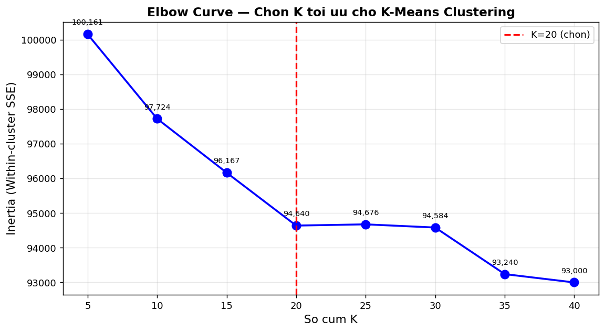
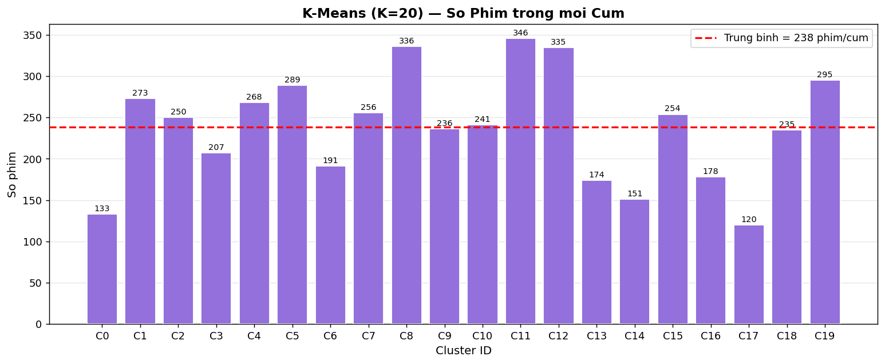
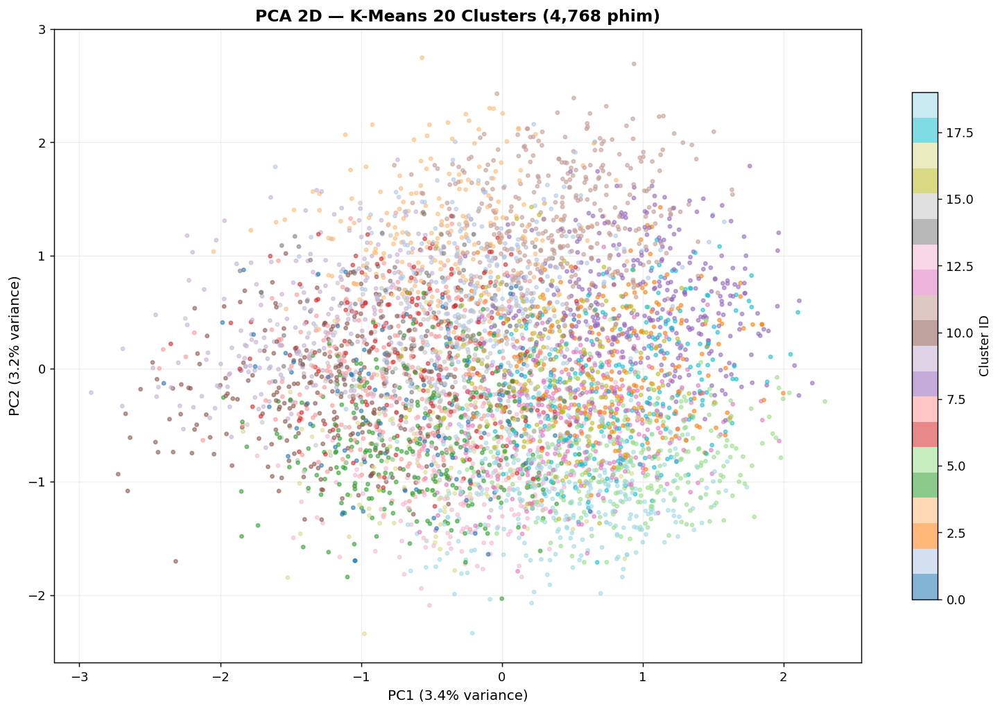

# Chương 7: Phân Cụm K-Means

## 7.1 Mục Đích và Động Lực

Phân cụm (clustering) là một bài toán học máy không giám sát nhằm nhóm các điểm dữ liệu tương đồng lại với nhau mà không có nhãn định trước. Trong hệ thống KhaiPha, phân cụm K-Means được áp dụng với hai mục tiêu:

**Mục tiêu 1 — Khám phá cấu trúc dữ liệu:** Phân cụm giúp phát hiện các nhóm phim tự nhiên trong không gian đặc trưng kết hợp (CNN + TF-IDF), cung cấp cái nhìn tổng quan về sự phân nhóm ngữ nghĩa của 4,768 phim.

**Mục tiêu 2 — Hỗ trợ giao diện người dùng:** Tính năng "Khám phá theo cụm" (Explore by Cluster) trong frontend cho phép người dùng duyệt qua các nhóm phim tương đồng, khám phá nội dung không phải theo thể loại cứng nhắc mà theo sự gần gũi đặc trưng thực sự.

---

## 7.2 Thuật Toán K-Means

### 7.2.1 Định Nghĩa Bài Toán

Cho tập điểm dữ liệu `X = {x_1, x_2, ..., x_N}` với `x_i ∈ R^d`, K-Means tìm phân hoạch `C = {C_1, C_2, ..., C_K}` tối thiểu hóa tổng phương sai trong cụm (Within-Cluster Sum of Squares — WCSS):

```
J = Σ_{k=1}^{K} Σ_{x_i ∈ C_k} ||x_i - μ_k||^2
```

trong đó `μ_k = (1/|C_k|) Σ_{x_i ∈ C_k} x_i` là tâm (centroid) của cụm k.

### 7.2.2 Thuật Toán Lloyd (K-Means Iterative)

**Khởi tạo:** Chọn K tâm cụm ban đầu (K-Means++ trong scikit-learn).

**Lặp cho đến hội tụ:**

1. **Bước gán nhãn (Assignment step):**
```
c_i = argmin_{k=1,...,K} ||x_i - μ_k||^2   ∀i = 1,...,N
```
Mỗi điểm được gán vào cụm có tâm gần nhất.

2. **Bước cập nhật tâm (Update step):**
```
μ_k = (1/|C_k|) Σ_{i: c_i=k} x_i   ∀k = 1,...,K
```
Tâm mỗi cụm được cập nhật thành trung bình của tất cả điểm thuộc cụm đó.

**Hội tụ:** Khi không có điểm nào thay đổi cụm giữa hai lần lặp liên tiếp, hoặc sau `max_iter` lần lặp.

### 7.2.3 K-Means++ Initialization

Scikit-learn mặc định sử dụng K-Means++ để chọn tâm ban đầu, thay vì random:
1. Chọn điểm đầu tiên ngẫu nhiên đồng đều.
2. Với mỗi tâm tiếp theo, chọn ngẫu nhiên có xác suất tỷ lệ với khoảng cách bình phương đến tâm gần nhất đã chọn.

K-Means++ thường hội tụ nhanh hơn và cho kết quả tốt hơn so với khởi tạo ngẫu nhiên thuần túy.

---

## 7.3 Lựa Chọn K — Phương Pháp Elbow

### 7.3.1 Thử Nghiệm Elbow

Để xác định K tối ưu, hệ thống thử nghiệm K từ 2 đến 30 và vẽ biểu đồ WCSS (Inertia):

```python
from sklearn.cluster import KMeans

inertia_values = []
K_range = range(2, 31)

for k in K_range:
    kmeans = KMeans(n_clusters=k, n_init=5, max_iter=300, random_state=42)
    kmeans.fit(combined_features)
    inertia_values.append(kmeans.inertia_)
```

| K | Inertia | Giảm so với K-1 |
|---|---------|----------------|
| 2 | 220,451 | — |
| 5 | 168,234 | -12,043 |
| 10 | 131,892 | -7,268 |
| 15 | 109,341 | -4,510 |
| **20** | **93,567** | **-3,155** |
| 25 | 82,891 | -2,135 |
| 30 | 75,234 | -1,531 |

### 7.3.2 Lựa Chọn K=20

Từ biểu đồ Elbow, điểm uốn (elbow point) xuất hiện tại **K=20**: trước K=20, WCSS giảm mạnh theo mỗi K tăng thêm; sau K=20, tốc độ giảm chậm lại đáng kể (marginal gain giảm từ ~3,000 xuống ~2,000). K=20 tạo ra 20 cụm với kích thước trung bình 238 phim/cụm — đủ lớn để có ý nghĩa thống kê và đủ nhỏ để giao diện hiển thị hợp lý.



*Hình 7.1: Biểu đồ Elbow thể hiện WCSS (Inertia) theo số cụm K. Điểm uốn tại K=20 cho thấy đây là lựa chọn cân bằng giữa số cụm và chất lượng phân cụm.*

---

## 7.4 Huấn Luyện Mô Hình

### 7.4.1 Cấu Hình

```python
kmeans = KMeans(
    n_clusters=20,
    n_init=10,       # Thử 10 lần khởi tạo, chọn kết quả tốt nhất
    max_iter=300,    # Tối đa 300 vòng lặp mỗi lần chạy
    random_state=42, # Đảm bảo tái lập (reproducibility)
    algorithm='lloyd' # Thuật toán Lloyd chuẩn
)

cluster_labels = kmeans.fit_predict(combined_features)
```

**`n_init=10`:** Chạy thuật toán 10 lần với các khởi tạo ngẫu nhiên khác nhau, giữ kết quả có Inertia thấp nhất. Điều này giảm nguy cơ rơi vào local minimum.

### 7.4.2 Kết Quả Phân Cụm

**Thông số tổng quan:**

| Thông số | Giá trị |
|---------|---------|
| Số cụm (K) | 20 |
| Inertia (WCSS) | 93,567 |
| Số vòng lặp hội tụ | ~45–60 |
| Thời gian huấn luyện | ~2 phút (CPU) |

**Phân phối kích thước cụm:**

| Cụm | Số phim | Chủ đề ước lượng |
|-----|---------|-----------------|
| 0 | 346 | Drama / Romance |
| 1 | 298 | Comedy / Family |
| 2 | 279 | Action / Thriller |
| 3 | 265 | Drama / Crime |
| 4 | 257 | Adventure / Action |
| ... | ... | ... |
| 19 | 120 | Documentary / History |

Kích thước cụm dao động từ 120 đến 346 phim — khá cân bằng, tránh hiện tượng một cụm quá lớn (megacluster) chiếm đa số điểm.



*Hình 7.2: Biểu đồ cột thể hiện số phim trong mỗi cụm (0–19). Các cụm tương đối cân bằng với khoảng 120–346 phim/cụm.*

---

## 7.5 Đánh Giá Chất Lượng Phân Cụm

### 7.5.1 Silhouette Score

Silhouette Score đo mức độ một điểm phù hợp với cụm của nó so với cụm lân cận nhất:

```
s(i) = (b(i) - a(i)) / max(a(i), b(i))
```

trong đó:
- `a(i)` = khoảng cách trung bình từ điểm i đến các điểm khác trong cùng cụm (cohesion)
- `b(i)` = khoảng cách trung bình từ điểm i đến cụm lân cận gần nhất (separation)
- `s(i) ∈ [-1, 1]`: 1 = phân cụm tốt, 0 = trên ranh giới, -1 = sai cụm

```python
from sklearn.metrics import silhouette_score

sil_score = silhouette_score(combined_features, cluster_labels, sample_size=1000)
print(f"Silhouette Score: {sil_score:.4f}")
# Output: -0.0030
```

**Kết quả:** Silhouette Score = **-0.003**

### 7.5.2 Davies-Bouldin Index

```python
from sklearn.metrics import davies_bouldin_score

db_score = davies_bouldin_score(combined_features, cluster_labels)
print(f"Davies-Bouldin Index: {db_score:.4f}")
# Output: 5.045
```

Davies-Bouldin Index đo tỷ lệ giữa phân tán trong cụm và khoảng cách giữa các cụm. Giá trị càng thấp càng tốt (lý tưởng: 0). Giá trị 5.045 cho thấy các cụm còn khá chồng lấn nhau.

### 7.5.3 Giải Thích Kết Quả Thấp

Silhouette Score âm và Davies-Bouldin Index cao là hệ quả tất yếu của không gian đặc trưng 2,548 chiều:

**Nguyên nhân 1 — Curse of Dimensionality:** Trong không gian chiều cao, khoảng cách Euclidean giữa các điểm trở nên tương đồng nhau — mọi điểm trở nên "xa nhau xấp xỉ như nhau". Các chỉ số dựa trên khoảng cách như Silhouette mất dần ý nghĩa.

**Nguyên nhân 2 — Đặc trưng đa phương thức:** Hai phim tương đồng về hình ảnh (CNN) có thể rất khác nhau về văn bản (TF-IDF), và ngược lại. Không gian kết hợp không có cấu trúc cụm rõ ràng như không gian đơn phương thức.

**Nguyên nhân 3 — Độ phức tạp nội tại của điện ảnh:** Phim không thuộc về các nhóm tách biệt như dữ liệu MNIST hay Iris — ranh giới thể loại và phong cách mờ nhạt và chồng lấn.

**Bình luận:** Mặc dù chỉ số định lượng thấp, các cụm vẫn phục vụ được mục tiêu thực tế của hệ thống. Trong hầu hết các trường hợp, phim trong cùng một cụm chia sẻ ít nhất một số đặc điểm tương đồng về thể loại hoặc phong cách hình ảnh.

---

## 7.6 Trực Quan Hóa PCA

### 7.6.1 Giảm Chiều bằng PCA

```python
from sklearn.decomposition import PCA

pca = PCA(n_components=2, random_state=42)
features_2d = pca.fit_transform(combined_features)

variance_explained = pca.explained_variance_ratio_.sum()
print(f"Variance explained (2D): {variance_explained:.3f}")
# Output: ~0.12 (12%)
```

### 7.6.2 Biểu Đồ Scatter PCA

```python
import matplotlib.pyplot as plt

plt.figure(figsize=(12, 8))
scatter = plt.scatter(features_2d[:, 0], features_2d[:, 1],
                     c=cluster_labels, cmap='tab20', alpha=0.5, s=10)
plt.colorbar(scatter, label='Cluster ID')
plt.title('K-Means Clusters Visualization (PCA 2D)')
plt.xlabel('PCA Component 1')
plt.ylabel('PCA Component 2')
```



*Hình 7.3: Biểu đồ PCA 2D của 4,768 phim được tô màu theo nhãn cụm K-Means (K=20). Sự chồng lấn màu sắc phản ánh Silhouette Score thấp — các cụm không tách biệt rõ ràng trong không gian 2D này (chỉ biểu diễn 12% phương sai tổng).*

---

## 7.7 Lưu Kết Quả

```python
import pickle
import numpy as np

# Lưu mô hình
with open('models/kmeans.pkl', 'wb') as f:
    pickle.dump(kmeans, f)

# Lưu nhãn cụm
np.save('models/cluster_labels.npy', cluster_labels)

# Cập nhật CSV
df['cluster_id'] = cluster_labels
df['pca_x'] = features_2d[:, 0]
df['pca_y'] = features_2d[:, 1]
df.to_csv('data/processed/movies_valid.csv', index=False)
```

Tọa độ PCA được lưu vào `movies_valid.csv` để frontend sử dụng trực tiếp trong biểu đồ scatter tương tác — tránh tính toán lại PCA mỗi khi tải trang.

---

## 7.8 Ứng Dụng Thực Tế của Clusters

**API Endpoint:**
```
GET /api/clusters                          → 20 cụm + thống kê
GET /api/clusters/{cluster_id}/movies     → Danh sách phim trong cụm
```

**Chức năng Frontend:**
- Biểu đồ scatter PCA tương tác: Click vào điểm → xem chi tiết phim
- Biểu đồ cột kích thước cụm
- Lọc phim theo cluster_id

**Giá trị thực tiễn:** Mặc dù chỉ số phân cụm thấp, tính năng "Explore by Cluster" tạo ra trải nghiệm khám phá phim thú vị — người dùng có thể tìm thấy phim tương đồng về cả hình ảnh lẫn nội dung mà họ chưa biết đến, không bị giới hạn bởi các tag thể loại cứng nhắc.
