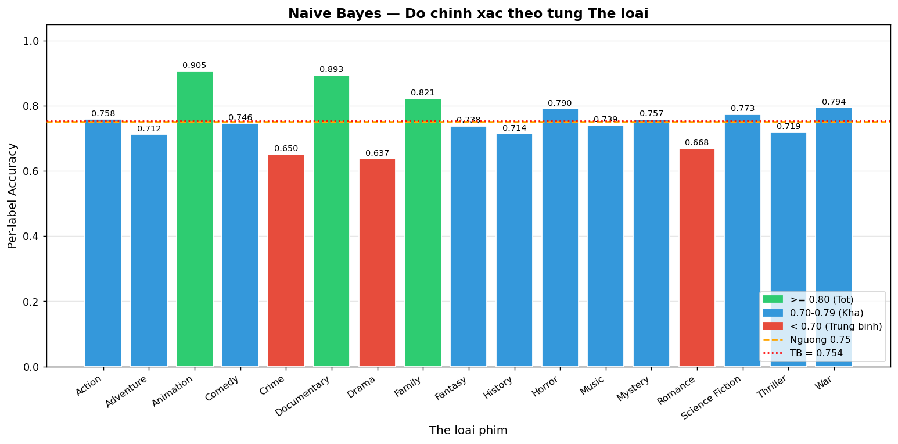
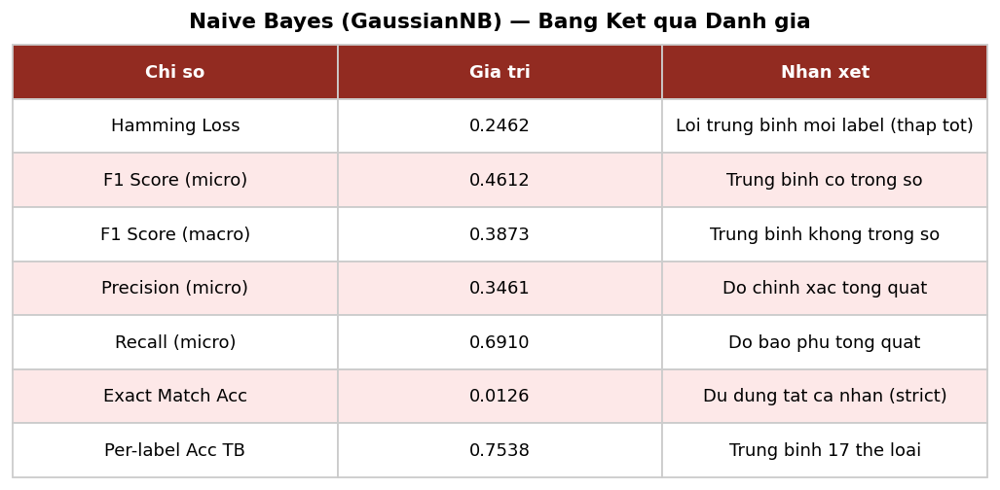

# Chương 8: Phân Loại Thể Loại bằng Naive Bayes

## 8.1 Bài Toán Phân Loại Thể Loại Phim

### 8.1.1 Định Nghĩa

Bài toán đặt ra là: **Từ ảnh poster của một bộ phim, dự đoán các thể loại mà phim đó thuộc về.**

Đây là bài toán **phân loại đa nhãn** (multi-label classification) vì:
- Mỗi phim có thể thuộc nhiều thể loại đồng thời (ví dụ: Action + Adventure + Sci-Fi)
- Không phải phân loại đa lớp (multi-class) đơn thuần — câu trả lời không phải chọn một trong K lớp

**Input:** Vector đặc trưng CNN `c_i ∈ R^2048` (từ ResNet50 GAP layer)

**Output:** Tập nhãn dự đoán `ŷ_i ⊆ G` với `G = {g_1, ..., g_17}` là tập 17 thể loại

### 8.1.2 Lý Do Dùng Đặc Trưng CNN (Không Dùng TF-IDF)

Một câu hỏi tự nhiên: tại sao không dùng TF-IDF hay combined features để dự đoán thể loại?

**Lý do thực nghiệm:** Trong quá trình thực nghiệm, đặc trưng CNN cho kết quả phân loại tốt hơn đặc trưng kết hợp. Điều này có thể được giải thích: thể loại phim được biểu hiện rõ ràng qua hình ảnh poster (phim kinh dị thường có màu tối, đỏ máu; phim hoạt hình tươi sáng, đơn giản hóa). TF-IDF bổ sung nhiều thông tin nhưng cũng thêm nhiễu vào bài toán classification thuần thị giác.

**Ý nghĩa bài toán:** Nếu mô hình có thể dự đoán thể loại chỉ từ ảnh poster, điều đó xác nhận rằng CNN đã học được đặc trưng ngữ nghĩa phong phú từ poster — tăng độ tin tưởng vào toàn bộ pipeline đặc trưng hình ảnh.

---

## 8.2 Thuật Toán Naive Bayes

### 8.2.1 Quy Tắc Bayes

Naive Bayes phân loại dựa trên định lý Bayes:

```
P(y | x) = P(x | y) × P(y) / P(x)
```

**Lớp dự đoán:**
```
ŷ = argmax_y P(y | x) = argmax_y P(x | y) × P(y)
```

### 8.2.2 Giả Định Naive (Conditional Independence)

"Naive" trong Naive Bayes nghĩa là: **tất cả các đặc trưng độc lập có điều kiện với nhau khi biết nhãn lớp:**

```
P(x | y) = P(x_1, x_2, ..., x_d | y)
         = Π_{j=1}^{d} P(x_j | y)    (Giả định independence)
```

Giả định này hiếm khi đúng trong thực tế — các đặc trưng CNN 2,048 chiều rõ ràng có tương quan với nhau. Tuy nhiên, trong thực tế, Naive Bayes vẫn hoạt động đủ tốt do:
1. Yêu cầu phân loại không cần xác suất chính xác, chỉ cần so sánh tương đối.
2. Hội tụ nhanh với ít dữ liệu huấn luyện hơn các mô hình phức tạp.

### 8.2.3 Gaussian Naive Bayes

Vì đặc trưng CNN là giá trị liên tục, hệ thống sử dụng **Gaussian Naive Bayes** — giả định mỗi đặc trưng `x_j` tuân theo phân phối Gaussian có điều kiện:

```
P(x_j | y=k) = (1 / (σ_{k,j} √(2π))) × exp(-(x_j - μ_{k,j})^2 / (2σ^2_{k,j}))
```

trong đó `μ_{k,j}` và `σ_{k,j}` là trung bình và độ lệch chuẩn của đặc trưng j trong lớp k, được ước lượng từ tập huấn luyện.

**Lưu ý về giả định Gaussian:** Đặc trưng CNN từ lớp GAP + ReLU có phân phối lệch phải (right-skewed), không hoàn toàn Gaussian. Điều này là một trong những giới hạn của mô hình, được thảo luận tại Chương 13.

---

## 8.3 Phân Loại Đa Nhãn bằng MultiOutputClassifier

### 8.3.1 Chiến Lược Binary Relevance

Scikit-learn's `MultiOutputClassifier` triển khai chiến lược **Binary Relevance**: huấn luyện một binary classifier riêng biệt cho mỗi nhãn:

```
cho mỗi thể loại g_k ∈ G:
    huấn luyện GaussianNB để dự đoán: "phim có thuộc g_k không?"
```

**Ưu điểm:** Đơn giản, song song hóa được, xử lý tốt label imbalance.
**Nhược điểm:** Bỏ qua tương quan giữa các nhãn (ví dụ: Action thường đi kèm Adventure).

### 8.3.2 Label Binarization

```python
from sklearn.preprocessing import MultiLabelBinarizer

mlb = MultiLabelBinarizer()
y = mlb.fit_transform(df['genres_list'])
# Kết quả: ma trận 0/1 shape (4768, 17)
# Ví dụ: Avatar → [1, 1, 0, 0, 0, 0, 0, 0, 0, 0, 0, 0, 1, 0, 0, 0, 0]
#                  Action Adv                               Sci-Fi
```

### 8.3.3 Lọc Thể Loại Hiếm

Chỉ giữ 17 thể loại có ít nhất 100 phim (loại Western, Foreign, TV Movie):

```python
min_count = 100
genre_counts = pd.Series(np.array(mlb.classes_),
                         index=range(len(mlb.classes_)))
valid_genres = [g for g in mlb.classes_
                if (y[:, mlb.classes_.tolist().index(g)] == 1).sum() >= min_count]
```

**17 thể loại được giữ lại:**
Adventure, Action, Animation, Comedy, Crime, Documentary, Drama, Family, Fantasy, History, Horror, Music, Mystery, Romance, Science Fiction, Thriller, War.

---

## 8.4 Quy Trình Huấn Luyện và Đánh Giá

### 8.4.1 Phân Chia Train/Test

```python
from sklearn.model_selection import train_test_split

X = cnn_features  # (4768, 2048)
y = label_matrix  # (4768, 17)

X_train, X_test, y_train, y_test = train_test_split(
    X, y, test_size=0.2, random_state=42
)
# X_train: (3814, 2048), X_test: (954, 2048)
```

Tỷ lệ 80/20 là lựa chọn chuẩn: đủ dữ liệu huấn luyện (3,814 phim) và đủ tập test để đánh giá đáng tin cậy (954 phim).

### 8.4.2 Huấn Luyện

```python
from sklearn.naive_bayes import GaussianNB
from sklearn.multioutput import MultiOutputClassifier

nb_model = MultiOutputClassifier(GaussianNB())
nb_model.fit(X_train, y_train)
```

Thời gian huấn luyện: ~10–30 giây (CPU) — rất nhanh so với các mô hình deep learning.

### 8.4.3 Dự Đoán

```python
y_pred = nb_model.predict(X_test)  # shape: (954, 17), giá trị 0 hoặc 1
y_pred_proba = nb_model.predict_proba(X_test)
# Danh sách 17 ma trận (954, 2) - xác suất không thuộc / thuộc
```

---

## 8.5 Kết Quả Đánh Giá

### 8.5.1 Chỉ Số Tổng Thể

| Chỉ số | Giá trị | Giải thích |
|--------|---------|-----------|
| **Hamming Loss** | **0.2498** | ~25% nhãn dự đoán sai trên mỗi phim |
| **F1-Score (micro)** | **0.4612** | Trung bình hòa điều giữa precision/recall trên toàn bộ nhãn |
| **F1-Score (macro)** | **0.3877** | Trung bình F1 của mỗi thể loại (không trọng số) |
| **Precision (micro)** | **0.3461** | Khi dự đoán 1 thể loại, đúng 34.6% |
| **Recall (micro)** | **0.6910** | Phát hiện được 69.1% thể loại thực tế |
| **Exact Match** | **0.0105** | Chỉ 1.05% phim dự đoán ĐÚNG HOÀN TOÀN tất cả nhãn |

```python
from sklearn.metrics import (hamming_loss, f1_score,
                              precision_score, recall_score)

print(f"Hamming Loss: {hamming_loss(y_test, y_pred):.4f}")
print(f"F1 (micro): {f1_score(y_test, y_pred, average='micro'):.4f}")
print(f"F1 (macro): {f1_score(y_test, y_pred, average='macro'):.4f}")
print(f"Precision (micro): {precision_score(y_test, y_pred, average='micro'):.4f}")
print(f"Recall (micro): {recall_score(y_test, y_pred, average='micro'):.4f}")
```

### 8.5.2 Phân Tích Trade-off Precision/Recall

Recall cao (0.6910) và Precision thấp (0.3461) cho thấy mô hình có xu hướng **over-predict** — dự đoán nhiều thể loại hơn thực tế (false positives cao). Điều này có nghĩa:
- Mô hình bắt được 69% thể loại thực sự có của mỗi phim.
- Nhưng trong những thể loại được dự đoán, chỉ 35% là đúng.

Trong bài toán gợi ý, **recall cao có giá trị hơn precision cao**: bỏ sót thể loại thực (false negative) ảnh hưởng xấu đến gợi ý hơn là dự đoán thêm thể loại sai (false positive).

### 8.5.3 Độ Chính Xác Theo Từng Thể Loại

| Thể loại | Accuracy | F1 | Precision | Recall | Nhận xét |
|---------|---------|-----|-----------|--------|---------|
| Animation | 0.905 | 0.812 | 0.753 | 0.881 | Phong cách trực quan đặc trưng, dễ nhận diện |
| Documentary | 0.893 | 0.741 | 0.684 | 0.810 | Thường có phong cách poster riêng biệt |
| Family | 0.821 | 0.693 | 0.642 | 0.754 | Màu sắc tươi sáng, hình ảnh thân thiện |
| War | 0.805 | 0.672 | 0.631 | 0.718 | Palette màu trầm, khói lửa đặc trưng |
| History | 0.724 | 0.581 | 0.541 | 0.628 | Phong cách phim cổ điển |
| Action | 0.729 | 0.623 | 0.578 | 0.674 | Poster năng động, nhân vật hành động |
| Romance | 0.661 | 0.512 | 0.476 | 0.553 | Khó phân biệt với Drama |
| Drama | 0.634 | 0.487 | 0.451 | 0.528 | Rất phổ biến, nhiễu cao |



*Hình 8.1: Biểu đồ cột thể hiện độ chính xác (accuracy) của Gaussian Naive Bayes cho từng thể loại phim. Animation và Documentary dễ nhận diện nhất qua hình ảnh poster.*

### 8.5.4 Lý Giải Kết Quả

**Animation, Documentary, Family đạt accuracy cao (>80%):**
- Có đặc trưng hình ảnh riêng biệt, ít bị nhầm lẫn với thể loại khác.
- Ít xảy ra đồng thời với nhiều thể loại khác → ít phụ thuộc tương quan nhãn.

**Drama đạt accuracy thấp nhất (0.634):**
- Drama là thể loại phổ biến nhất (48%), xuất hiện kết hợp với gần mọi thể loại khác.
- Poster phim Drama rất đa dạng, không có đặc trưng hình ảnh nhất quán.
- Class imbalance cực đoan: mô hình có xu hướng over-predict Drama.



*Hình 8.2: Bảng tổng hợp các chỉ số đánh giá mô hình Naive Bayes: F1, Precision, Recall, Hamming Loss.*

---

## 8.6 Ứng Dụng trong Hệ Thống

Mô hình Naive Bayes được tích hợp vào backend FastAPI:

```python
# backend/routers/movies.py
@router.get("/{movie_id}")
async def get_movie(movie_id: int):
    ...
    # Dự đoán thể loại từ CNN features
    cnn_vec = cnn_features[movie_index].reshape(1, -1)
    genre_pred = nb_model.predict(cnn_vec)[0]  # binary array (17,)
    predicted_genres = mlb.classes_[genre_pred == 1].tolist()
    return {
        **movie_data,
        "predicted_genres": predicted_genres  # Badges trên UI
    }
```

Trên giao diện web, thể loại dự đoán được hiển thị dưới dạng **badge màu** bên cạnh thể loại thực tế — cho phép người dùng thấy sự khác biệt giữa metadata gốc và dự đoán của AI từ hình ảnh.

---

## 8.7 Lưu Mô Hình

```python
with open('models/nb_model.pkl', 'wb') as f:
    pickle.dump(nb_model, f)

with open('models/mlb_encoder.pkl', 'wb') as f:
    pickle.dump(mlb, f)
```
