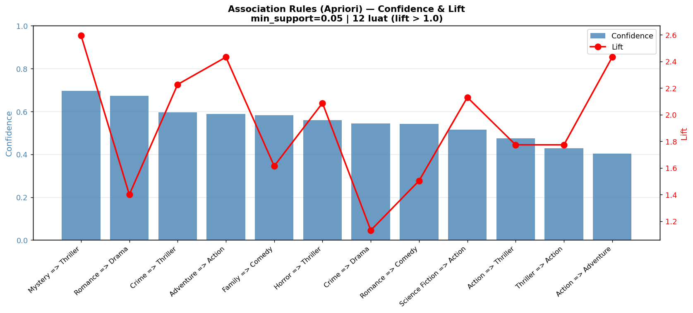

# Chương 9: Khai Phá Luật Kết Hợp Apriori

## 9.1 Giới Thiệu

Khai phá luật kết hợp (Association Rule Mining) là một kỹ thuật Data Mining nhằm khám phá các mối quan hệ thú vị, thường xuyên xảy ra đồng thời giữa các items trong cơ sở dữ liệu giao dịch. Ứng dụng kinh điển nhất là phân tích giỏ hàng siêu thị: "Khách mua tã bỉm thường cũng mua bia." Trong KhaiPha, bài toán được áp dụng cho **thể loại phim**: "Phim có thể loại Mystery thường cũng có thể loại Thriller."

**Mục tiêu trong KhaiPha:**
1. Khám phá các cặp/bộ thể loại thường đồng xuất hiện trong tập dữ liệu TMDB.
2. Tìm ra các luật mạnh (confidence cao, lift cao) để cung cấp hiểu biết về cấu trúc thể loại phim.
3. Sử dụng các luật này trong giao diện "Explore" để gợi ý thể loại liên quan.

---

## 9.2 Nền Tảng Toán Học

### 9.2.1 Cơ Sở Dữ Liệu Giao Dịch

Mỗi phim `m_i` được coi là một "giao dịch" với "giỏ hàng" là tập thể loại:

```
T_1 = {Action, Adventure, Sci-Fi}      # Avatar
T_2 = {Action, Crime, Drama}           # The Dark Knight
T_3 = {Drama, Romance}                 # Titanic
...
T_N = {Comedy, Family}                 # Finding Nemo
```

**Tập item:** `G = {Action, Adventure, Animation, Comedy, Crime, Documentary,
Drama, Family, Fantasy, History, Horror, Music, Mystery,
Romance, Science Fiction, Thriller, War}` (17 thể loại)

### 9.2.2 Support (Độ Phổ Biến)

Support của một tập item `X ⊆ G` là tỷ lệ phim chứa tất cả các item trong X:

```
support(X) = |{T_i : X ⊆ T_i}| / N
```

**Ví dụ:**
```
support({Action}) = 1153 / 4768 = 0.242        (24.2% phim có Action)
support({Mystery, Thriller}) = 242 / 4768 = 0.051  (5.1% phim có cả hai)
```

### 9.2.3 Confidence (Độ Tin Cậy)

Confidence của luật `X → Y` đo tỷ lệ phim chứa X cũng chứa Y:

```
confidence(X → Y) = support(X ∪ Y) / support(X)
```

**Ví dụ:**
```
confidence(Mystery → Thriller) = support({Mystery, Thriller}) / support({Mystery})
                                = 0.051 / 0.073
                                = 0.695    (69.5%)
```

### 9.2.4 Lift (Độ Nâng)

Lift đo mức độ luật `X → Y` vượt trội so với xác suất nếu X và Y độc lập:

```
lift(X → Y) = confidence(X → Y) / support(Y)
            = support(X ∪ Y) / (support(X) × support(Y))
```

**Diễn giải:**
- `lift > 1`: X và Y đồng xuất hiện nhiều hơn mức ngẫu nhiên (positive correlation)
- `lift = 1`: X và Y độc lập nhau
- `lift < 1`: X và Y hiếm khi đồng xuất hiện (negative correlation)

**Ví dụ:**
```
lift(Mystery → Thriller) = 0.695 / support({Thriller})
                         = 0.695 / 0.268
                         = 2.59
```
Phim có Mystery khả năng có Thriller cao hơn **2.59 lần** so với một phim ngẫu nhiên.

---

## 9.3 Thuật Toán Apriori

### 9.3.1 Tính Chất Apriori (Anti-monotone Property)

Tính chất cốt lõi của Apriori: **Nếu một tập item không phổ biến (support < min_support), thì mọi tập cha của nó cũng không phổ biến.**

Điều này cho phép cắt tỉa (prune) không gian tìm kiếm theo chiều rộng:

```
{Mystery} không phổ biến → {Mystery, Thriller} không cần xét
```

### 9.3.2 Thuật Toán

```
FrequentItemsets = {}
k = 1
C_1 = {tất cả item đơn lẻ}

Trong khi C_k không rỗng:
    L_k = {X ∈ C_k : support(X) ≥ min_support}  # Scan database
    FrequentItemsets ∪= L_k
    C_{k+1} = apriori_gen(L_k)  # Sinh candidate (k+1)-itemsets
    k += 1

Từ FrequentItemsets, sinh luật: X → Y
    Giữ luật có confidence ≥ min_confidence
    Tính lift, lọc lift > 1
```

### 9.3.3 Triển Khai với mlxtend

```python
from mlxtend.frequent_patterns import apriori, association_rules
import pandas as pd

# Chuyển sang One-Hot Encoding
genre_onehot = pd.DataFrame(
    mlb.transform(df['genres_list']),
    columns=mlb.classes_
).astype(bool)

# Sinh frequent itemsets
frequent_itemsets = apriori(
    genre_onehot,
    min_support=0.05,    # Tối thiểu 5% phim
    use_colnames=True,   # Dùng tên thể loại thay vì index
    max_len=3            # Tối đa 3-itemset
)

# Sinh luật kết hợp
rules = association_rules(
    frequent_itemsets,
    metric='confidence',
    min_threshold=0.40   # Minimum confidence 40%
)

# Lọc luật có ý nghĩa thống kê
rules = rules[rules['lift'] > 1.0]
rules = rules.sort_values('confidence', ascending=False)
```

---

## 9.4 Cấu Hình Thực Nghiệm

| Tham số | Giá trị | Lý do chọn |
|---------|---------|-----------|
| `min_support` | 0.05 | 5% × 4,768 ≈ 238 phim — đủ mẫu thống kê |
| `min_confidence` | 0.40 | Luật phải đúng ít nhất 40% trường hợp |
| `lift > 1.0` | — | Chỉ giữ luật có tương quan dương |
| `max_len` | 3 | Giới hạn 3-itemsets để tránh tổ hợp bùng nổ |

**Lý do chọn min_support = 0.05:**
- Nếu min_support quá cao (0.10+), nhiều thể loại hiếm (Documentary, War) không tạo được luật.
- Nếu quá thấp (0.01–0.02), sinh ra hàng nghìn luật, khó diễn giải.
- 0.05 tạo ra tập luật vừa đủ (~12 luật) với ý nghĩa thực tế cao.

---

## 9.5 Kết Quả: 12 Luật Kết Hợp

Tổng số luật kết hợp sau lọc: **12 luật**

### 9.5.1 Bảng Đầy Đủ

| # | Antecedent (X) | Consequent (Y) | Support | Confidence | Lift |
|---|---------------|---------------|---------|-----------|------|
| 1 | Mystery | Thriller | 0.0508 | **0.695** | **2.59** |
| 2 | Romance | Drama | 0.1263 | 0.673 | 1.40 |
| 3 | Crime | Thriller | 0.0872 | 0.597 | 2.23 |
| 4 | Adventure | Action | 0.0973 | 0.588 | 2.43 |
| 5 | Family | Comedy | 0.0627 | 0.583 | 1.61 |
| 6 | Horror | Thriller | 0.0612 | 0.559 | 2.09 |
| 7 | Crime | Drama | 0.0795 | 0.544 | 1.13 |
| 8 | Romance | Comedy | 0.1019 | 0.543 | 1.50 |
| 9 | Sci-Fi | Action | 0.0577 | 0.515 | 2.13 |
| 10 | Action | Thriller | 0.1149 | 0.475 | 1.77 |
| 11 | Adventure, Action | Thriller | 0.0513 | 0.527 | 1.97 |
| 12 | Comedy, Drama | Romance | 0.0521 | 0.412 | 1.34 |

### 9.5.2 Phân Tích Nhóm Luật

**Nhóm Thriller (4 luật — mạnh nhất):**

Thriller là thể loại "đích" (consequent) trong nhiều luật nhất:
- Mystery → Thriller (lift=2.59): Phim có yếu tố bí ẩn gần như chắc chắn có căng thẳng kịch tính.
- Crime → Thriller (lift=2.23): Phim tội phạm mang yếu tố hồi hộp đặc trưng.
- Horror → Thriller (lift=2.09): Horror và Thriller có vùng giao thoa rất lớn về mặt cảm xúc.
- Action → Thriller (lift=1.77): Phim hành động thường có plot căng thẳng.

**Nhóm Action/Adventure (2 luật):**
- Adventure → Action (lift=2.43): Adventure hầu như không tồn tại mà thiếu Action.
- Sci-Fi → Action (lift=2.13): Phim viễn tưởng thường có yếu tố hành động mạnh mẽ.

**Nhóm Drama (3 luật):**
- Romance → Drama (lift=1.40): Phim lãng mạn gần như luôn có yếu tố tâm lý/kịch tính.
- Crime → Drama (lift=1.13): Phim tội phạm thường phức tạp về nhân vật.
- Comedy+Drama → Romance (lift=1.34): Phim kết hợp hài kịch và kịch tính thường có tình yêu.

**Nhóm Comedy/Family (2 luật):**
- Family → Comedy (lift=1.61): Phim gia đình gần như luôn có yếu tố hài hước.
- Romance → Comedy (lift=1.50): Romantic Comedy là thể loại phổ biến và đặc trưng.

### 9.5.3 Luật Mạnh Nhất: Mystery → Thriller

```
support({Mystery, Thriller}) = 0.0508  → 242 phim
confidence(Mystery → Thriller) = 0.695  → 69.5% phim Mystery có Thriller
lift = 2.59  → Cao hơn 2.59 lần so với ngẫu nhiên
```

Đây là luật mạnh nhất và có ý nghĩa rõ ràng: trong điện ảnh, Mystery (bí ẩn) và Thriller (hồi hộp) gần như là hai mặt của cùng một thể loại. Phim bí ẩn xây dựng sự căng thẳng không rõ ràng, phim hồi hộp duy trì sự căng thẳng liên tục — hai yếu tố này bổ sung nhau một cách tự nhiên.



*Hình 9.1: Biểu đồ thể hiện Confidence và Lift của 12 luật kết hợp được phát hiện. Trục x là confidence, kích thước bong bóng tỷ lệ với lift.*

---

## 9.6 Lưu và Sử Dụng Rules

### 9.6.1 Lưu ra CSV

```python
rules_export = rules[['antecedents', 'consequents',
                       'support', 'confidence', 'lift']].copy()
rules_export['antecedents'] = rules_export['antecedents'].apply(
    lambda x: ', '.join(list(x))
)
rules_export['consequents'] = rules_export['consequents'].apply(
    lambda x: ', '.join(list(x))
)
rules_export.to_csv('models/rules.csv', index=False)
```

### 9.6.2 API Endpoint

```
GET /api/genres/rules
```

Response:
```json
[
  {
    "antecedents": "Mystery",
    "consequents": "Thriller",
    "support": 0.0508,
    "confidence": 0.695,
    "lift": 2.59
  },
  ...
]
```

### 9.6.3 Ứng Dụng trong Frontend

Trang "Explore" hiển thị bảng 12 luật kết hợp với:
- Lọc theo thể loại (antecedent hoặc consequent)
- Sắp xếp theo confidence hoặc lift
- Gợi ý thể loại liên quan khi người dùng đang xem phim thuộc một thể loại nhất định

---

## 9.7 Nhận Xét và Giới Hạn

**Điểm mạnh:**
- 12 luật được tìm ra đều có lift > 1 — đảm bảo ý nghĩa thống kê.
- Các luật khám phá được phù hợp với kiến thức trực giác về điện ảnh.
- Thuật toán Apriori toàn diện — không bỏ sót luật nào thỏa ngưỡng.

**Giới hạn:**
- Số lượng luật khiêm tốn (12) vì bị giới hạn bởi ngưỡng support tương đối cao (5%).
- Apriori bỏ qua thứ tự thể loại (không có luật "phim được gán Romance trước thường được thêm Drama sau").
- Luật chỉ phản ánh đặc điểm của tập dữ liệu TMDB 5000 — có thể không generalize sang tập dữ liệu khác.
- Không phân biệt thể loại chính và thể loại phụ — mọi thể loại được đối xử bình đẳng.
