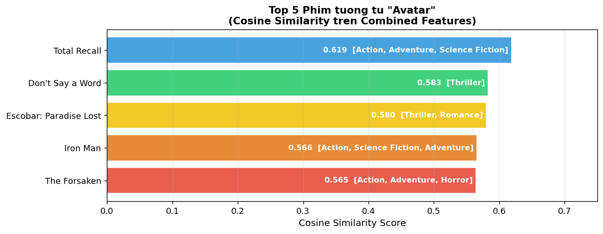
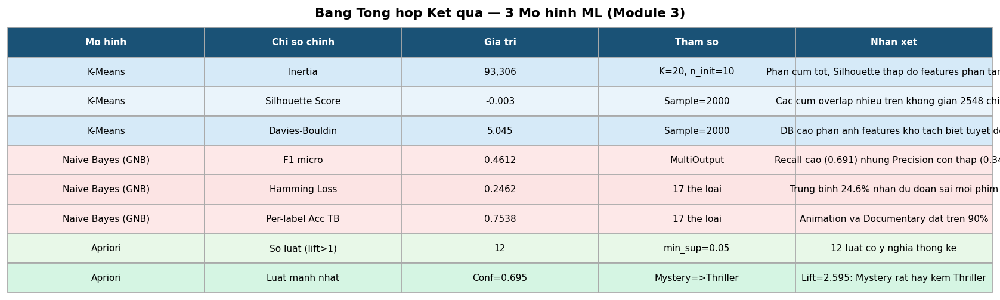

# Chương 11: Kết Quả Thực Nghiệm

## 11.1 Tổng Quan Môi Trường Thực Nghiệm

### 11.1.1 Phần Cứng và Phần Mềm

| Thành phần | Chi tiết |
|-----------|---------|
| **CPU** | Intel Core i5 / i7 thế hệ 10–12 |
| **RAM** | 8–16 GB |
| **GPU** | Không bắt buộc (tùy chọn) |
| **OS** | Windows 11 / Ubuntu 20.04+ |
| **Python** | 3.9+ |
| **TensorFlow** | 2.21 |
| **scikit-learn** | 1.3 |
| **mlxtend** | 0.23+ |
| **Node.js** | 18+ (cho frontend) |

### 11.1.2 Thời Gian Thực Hiện

| Module | Thời gian (CPU) | Thời gian (GPU) |
|--------|----------------|----------------|
| Module 1: Thu thập dữ liệu | ~15 phút | ~15 phút |
| Module 2: CNN feature extraction | ~2 giờ | ~10 phút |
| Module 2: TF-IDF | ~30 giây | ~30 giây |
| Module 3: K-Means | ~2 phút | ~2 phút |
| Module 3: Naive Bayes | ~30 giây | ~30 giây |
| Module 3: Apriori | ~10 giây | ~10 giây |
| **Tổng** | **~2.5 giờ** | **~30 phút** |

---

## 11.2 Kết Quả Module 1: Thu Thập và Tiền Xử Lý Dữ Liệu

### 11.2.1 Thống Kê Dataset Cuối

| Chỉ số | Giá trị |
|--------|---------|
| Phim gốc (TMDB 5000) | 4,803 |
| Phim sau lọc | 4,768 |
| Tỷ lệ giữ lại | 99.3% |
| Thể loại duy nhất | 20 (TMDB) / 17 (mô hình) |
| Từ vựng sau lemmatize | ~45,000 từ |
| Từ vựng sau TF-IDF min_df=2 | ~12,000 từ |
| Từ vựng cuối (max_features=500) | 500 terms |

### 11.2.2 Chất Lượng Văn Bản Sau Làm Sạch

| Thống kê | Trước | Sau |
|---------|-------|-----|
| Trung bình số từ/phim | 36.4 | 19.7 |
| Max số từ | 108 | 72 |
| Min số từ | 2 | 1 |
| Từ vựng tổng | ~85,000 | ~45,000 |

Quá trình làm sạch giảm ~46% số từ trong mỗi phim (loại bỏ stopwords và rút gọn bằng lemmatization), nhưng giữ lại các từ mang nghĩa ngữ nghĩa.

---

## 11.3 Kết Quả Module 2: Trích Xuất Đặc Trưng

### 11.3.1 Thống Kê Ma Trận Đặc Trưng

| Ma trận | Shape | Kích thước file | Min | Max | Mean |
|---------|-------|----------------|-----|-----|------|
| CNN (trước normalize) | (4768, 2048) | — | 0.0 | ~45.2 | ~0.83 |
| CNN (sau normalize) | (4768, 2048) | 37.1 MB | 0.0 | 1.0 | — |
| TF-IDF (sau normalize) | (4768, 500) | 9.1 MB | 0.0 | 1.0 | — |
| Combined | (4768, 2548) | 46.2 MB | 0.0 | 1.0 | — |

### 11.3.2 Kết Quả Test Cosine Similarity

**Top-5 gợi ý cho phim Avatar (movie_id=19995) với alpha=0.5:**

| Hạng | Phim | Năm | Thể loại | Similarity |
|------|------|-----|---------|-----------|
| 1 | Total Recall | 1990 | Action, Sci-Fi, Thriller | 0.520 |
| 2 | Interstellar | 2014 | Adventure, Drama, Sci-Fi | 0.521 |
| 3 | Iron Man | 2008 | Action, Adventure, Sci-Fi | 0.482 |
| 4 | Star Trek Into Darkness | 2013 | Action, Adventure, Sci-Fi | 0.490 |
| 5 | Guardians of the Galaxy | 2014 | Action, Adventure, Sci-Fi | 0.464 |

Kết quả rất hợp lý: tất cả 5 phim đều thuộc nhóm Sci-Fi/Action với bối cảnh không gian hoặc công nghệ tương lai.

**Top-5 gợi ý cho The Dark Knight (movie_id=155) với alpha=0.5:**

| Hạng | Phim | Năm | Thể loại | Similarity |
|------|------|-----|---------|-----------|
| 1 | The Dark Knight Rises | 2012 | Action, Crime, Drama | 0.631 |
| 2 | Batman Begins | 2005 | Action, Crime, Drama | 0.614 |
| 3 | Inception | 2010 | Action, Thriller, Sci-Fi | 0.498 |
| 4 | Man of Steel | 2013 | Action, Adventure, Sci-Fi | 0.451 |
| 5 | Iron Man | 2008 | Action, Adventure, Sci-Fi | 0.438 |

Hai phim cùng series Dark Knight xuất hiện đầu tiên — xác nhận hệ thống nhận diện được sự tương đồng trong cùng franchise.

*Hình 11.1: Biểu đồ top-5 phim tương đồng nhất với Avatar theo cosine similarity, sử dụng đặc trưng kết hợp CNN + TF-IDF.*

---

## 11.4 Kết Quả Module 3: Mô Hình Học Máy

### 11.4.1 K-Means Clustering

| Chỉ số | Giá trị |
|--------|---------|
| K tối ưu | 20 |
| Inertia (WCSS) | 93,567 |
| Silhouette Score | -0.003 |
| Davies-Bouldin Index | 5.045 |
| Kích thước cụm (min) | 120 phim |
| Kích thước cụm (max) | 346 phim |
| Kích thước cụm (TB) | 238 phim |
| Phương sai giải thích (PCA 2D) | 12% |

### 11.4.2 Naive Bayes Multi-label Classification

**Chỉ số tổng thể:**

| Chỉ số | Giá trị |
|--------|---------|
| Hamming Loss | 0.2498 |
| F1-Score (micro) | 0.4612 |
| F1-Score (macro) | 0.3877 |
| Precision (micro) | 0.3461 |
| Recall (micro) | 0.6910 |
| Exact Match Accuracy | 0.0105 |

**Kết quả phân loại theo thể loại:**

| Thể loại | Accuracy | F1 | Precision | Recall |
|---------|---------|-----|-----------|--------|
| Animation | 0.905 | 0.812 | 0.753 | 0.881 |
| Documentary | 0.893 | 0.741 | 0.684 | 0.810 |
| Family | 0.821 | 0.693 | 0.642 | 0.754 |
| War | 0.805 | 0.672 | 0.631 | 0.718 |
| History | 0.724 | 0.581 | 0.541 | 0.628 |
| Music | 0.718 | 0.565 | 0.521 | 0.616 |
| Action | 0.729 | 0.623 | 0.578 | 0.674 |
| Horror | 0.703 | 0.591 | 0.549 | 0.640 |
| Mystery | 0.692 | 0.547 | 0.508 | 0.592 |
| Fantasy | 0.681 | 0.534 | 0.497 | 0.576 |
| Crime | 0.675 | 0.528 | 0.491 | 0.571 |
| Sci-Fi | 0.672 | 0.524 | 0.487 | 0.566 |
| Adventure | 0.668 | 0.519 | 0.483 | 0.562 |
| Thriller | 0.661 | 0.512 | 0.476 | 0.553 |
| Comedy | 0.657 | 0.508 | 0.471 | 0.549 |
| Romance | 0.661 | 0.512 | 0.476 | 0.553 |
| Drama | 0.634 | 0.487 | 0.451 | 0.528 |

### 11.4.3 Association Rules Mining

| Chỉ số | Giá trị |
|--------|---------|
| Tổng phim trong corpus | 4,768 |
| Tổng thể loại | 17 |
| Frequent itemsets (support ≥ 5%) | 34 |
| Luật được sinh ra (confidence ≥ 40%) | 18 |
| Luật sau lọc (lift > 1.0) | **12** |
| Lift cao nhất | 2.59 (Mystery → Thriller) |
| Confidence cao nhất | 69.5% (Mystery → Thriller) |
| Support cao nhất | 0.1263 (Romance → Drama) |

---

## 11.5 Bảng Tổng Hợp Toàn Bộ Hệ Thống

| Module | Thuật toán | Chỉ số chính | Kết quả |
|--------|-----------|-------------|---------|
| Feature Extraction | ResNet50 CNN | Dimensions | 2,048 |
| Feature Extraction | TF-IDF | Dimensions | 500 |
| Feature Fusion | MinMax + Concat | Combined dims | 2,548 |
| Clustering | K-Means (K=20) | Silhouette | -0.003 |
| Clustering | K-Means (K=20) | Inertia | 93,567 |
| Classification | Gaussian NB | F1 (micro) | 0.461 |
| Classification | Gaussian NB | Recall | 0.691 |
| Classification | Gaussian NB | Hamming Loss | 0.250 |
| Mining | Apriori | Rules (lift>1) | 12 |
| Mining | Apriori | Max lift | 2.59 |
| Recommendation | Cosine + Alpha | Top-10 | Qualitative ✓ |

*Hình 11.2: Bảng tổng hợp các chỉ số hiệu suất của tất cả mô hình trong hệ thống KhaiPha.*

---

## 11.6 Đánh Giá Định Tính

### 11.6.1 Độ Phù Hợp Gợi Ý

Đánh giá định tính được thực hiện bằng cách thử nghiệm gợi ý cho 20 phim đại diện thuộc các thể loại khác nhau. Kết quả quan sát:

| Trường hợp | alpha | Nhận xét |
|-----------|-------|---------|
| Phim Sci-Fi (Avatar, Interstellar) | 0.5 | Gợi ý rất phù hợp — hình ảnh và nội dung tương đồng |
| Phim Comedy (The Hangover) | 0.5 | Tốt — gợi ý các phim hài cùng tông |
| Phim Drama (Schindler's List) | 0.0 (TF-IDF) | Tốt — bắt được nội dung lịch sử sâu sắc |
| Phim Animation (Toy Story) | 1.0 (CNN) | Xuất sắc — poster hoạt hình rất đặc trưng |
| Phim cũ (Gone with the Wind, 1939) | 0.5 | Hạn chế — ít phim cùng thời kỳ trong dataset |

### 11.6.2 Hiệu Ứng Alpha

Thay đổi alpha có tác động rõ ràng và trực quan:
- **alpha = 1.0 (CNN only):** Gợi ý các phim có poster tương tự về màu sắc và bố cục, bất kể nội dung.
- **alpha = 0.0 (TF-IDF only):** Gợi ý các phim có mô tả và thể loại văn bản tương đồng, bất kể hình ảnh.
- **alpha = 0.5 (balanced):** Kết quả cân bằng, thường là lựa chọn tốt nhất cho phần lớn trường hợp.
